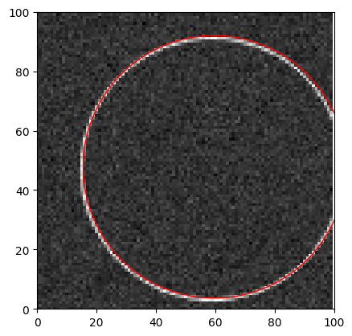
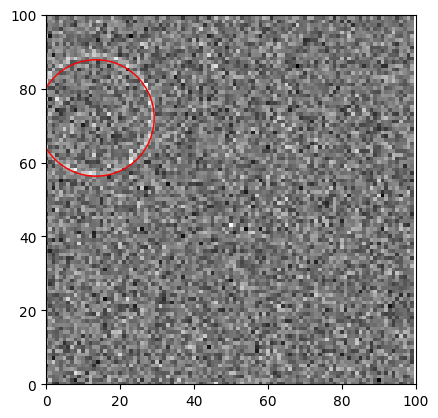

# noisy-circles
A CNN is used to infer the radius and center of a circle in an image with an arbitrary amount of gaussian noise.

  
  

#### Data
Due to the synthetic nature of the data, generating new datapoints is very efficient. So, the model is trained on continuously generated data, never seeing the same image twice. This helps to help the model generalize and prevents overfitting. The training dataset has the following properties:

|  Property         | Value  |
|-----------------|-------|
| Image Size | 100x100  |
| Min Radius| 10  |
| Max Radius | 50  |
| Min Noise | 0.0  |
| Max Noise | 0.6  |

where noise refers to the S.D. of the gaussian noise added to the image. Both noise and radius are sampled from a uniform distribution. Before being passed to the model, data are normalized according to the distribution from which they are sampled.

#### Training
The CNN consists of 4 convolutional layers which project the image into 128 channels, followed by 5 fully connected layers which regress a 3D vector corresponding to the radius of the circle, and the row and column of its center. ReLU activations are used in the convolutional layers and LeakyReLU activations are used in the fully connected layers. MSELoss is used to learn the output features. The entire network consists of ~2M trainable parameters.

#### Evaluation

On a test set of 1000 images, the model achieves the following thresholded IOU (Intersection Over Union) performance:

| IOU Threshold          | % Images above threshold  |
|-----------------|-------|
| 0.5 | 0.99  |
| 0.75| 0.94  |
| 0.9 | 0.54  |

